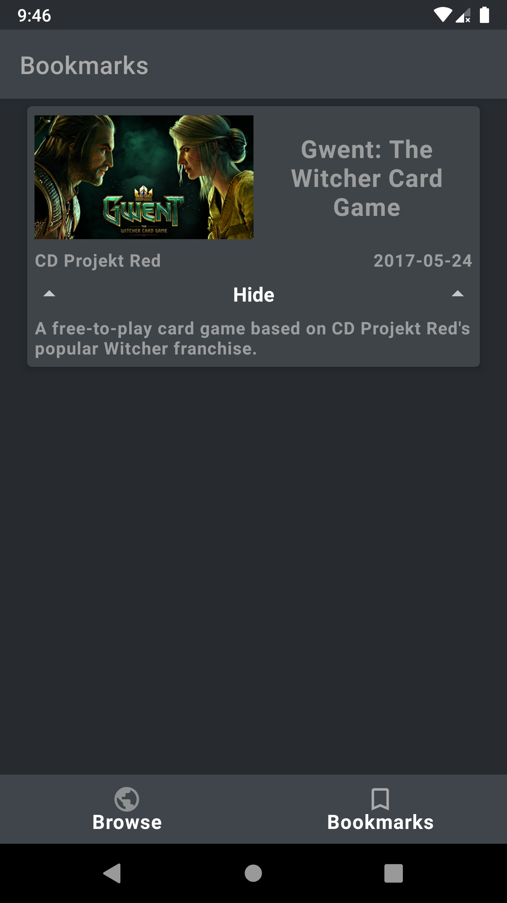

# FlexingFreeGames
FlexingFreeGames is an Android sample application created for learning purposes only.\
This application is based on [FreeToGame.com API](https://www.freetogame.com/api-doc) and provides an ability to search free-to-play games with a lot of additional information.

## Screenshots
### XML view system
#### Browse
<p align="center">
  
  <br/>
  
</p>

#### Details and Bookmarks
<p align="center">
  
   
   
</p>

### Jetpack Compose
#### Browse
<p align="center">
  
  <br/>
  
</p>

#### Details and Bookmarks
<p align="center">
  
   
   
</p>

## Tech stack and concepts
* **[Kotlin](https://kotlinlang.org/)** as programming language.
* **[Kotlin coroutines](https://kotlin.github.io/kotlinx.coroutines/kotlinx-coroutines-core/)** as framework for asynchronous jobs. (**[RxJava](https://github.com/ReactiveX/RxJava)** as its alternative (**/Dagger2+RxJava** branch)).
  * **Flow** (*StateFlow*) as dataholder for UI layer. (**Livedata** as its alternative (**/Dagger2+RxJava** branch)). 
* Single activity support.
  * **[Fragments](https://developer.android.com/jetpack/androidx/releases/fragment)**.
  * **[Navigation components](https://developer.android.com/jetpack/androidx/releases/navigation)**.
* **[Jetpack Compose](https://developer.android.com/jetpack/compose)** as modern declarative UI toolkit (**/compose** branch).
* Modern XML UI toolkit.
  * **[Material components](https://material.io/develop/android)**.
  * **ViewBinding** for binding .xml views to objects in Activities and Fragments.
* API-based remote data layer.
  * **[Retrofit](https://square.github.io/retrofit/)** for network queries.
  * **[Moshi](https://github.com/square/moshi)** for parsing JSON.
* **[DataStore](https://developer.android.com/jetpack/androidx/releases/datastore)** for working with user preferences (e.g. search filter preferences)
* **[Room](https://developer.android.com/jetpack/androidx/releases/room)** for local data layer.
* **[Lifecycle components](https://developer.android.com/jetpack/androidx/releases/lifecycle)**.
  * **ViewModel** for implementing MVI pattern.
* **[Glide](https://github.com/bumptech/glide)** and **[Coil](https://coil-kt.github.io/coil/)** for working with images.
* Testing.
  * **JUnit**.
  * **[Android testing library](https://developer.android.com/jetpack/androidx/releases/test)**.
  * **Espresso** for UI-testing.
  * Specific testing artifacts for other libraries.
  * **Compose testing libraries**.
* **[Hilt](https://dagger.dev/hilt/)** for dependency injection. (**[Dagger 2](https://dagger.dev/)** as its alternative (**/Dagger2+RxJava** branch)).

## Key features
#### i.e. what is unique among other samples?
* **MVI** UI-layer architecture (utilizing **State**, **Intent**, **Event** classes).
* **Filter-based** search request for API.
  - **DataStore<Preferences>** implementation for saving and restoring the filters.
* **Moshi** usage.
* Dynamic layout based on user actions (animated sliding of some panels out and in).
* Dynamic layout based on orientation (portrait/landscape).
* **ViewPager** implementation for creating **carousel view** for images (game screenshots).

## License
```
MIT License

Copyright (c) 2022 Shvyndia Andrii

Permission is hereby granted, free of charge, to any person obtaining a copy
of this software and associated documentation files (the "Software"), to deal
in the Software without restriction, including without limitation the rights
to use, copy, modify, merge, publish, distribute, sublicense, and/or sell
copies of the Software, and to permit persons to whom the Software is
furnished to do so, subject to the following conditions:

The above copyright notice and this permission notice shall be included in all
copies or substantial portions of the Software.

THE SOFTWARE IS PROVIDED "AS IS", WITHOUT WARRANTY OF ANY KIND, EXPRESS OR
IMPLIED, INCLUDING BUT NOT LIMITED TO THE WARRANTIES OF MERCHANTABILITY,
FITNESS FOR A PARTICULAR PURPOSE AND NONINFRINGEMENT. IN NO EVENT SHALL THE
AUTHORS OR COPYRIGHT HOLDERS BE LIABLE FOR ANY CLAIM, DAMAGES OR OTHER
LIABILITY, WHETHER IN AN ACTION OF CONTRACT, TORT OR OTHERWISE, ARISING FROM,
OUT OF OR IN CONNECTION WITH THE SOFTWARE OR THE USE OR OTHER DEALINGS IN THE
SOFTWARE.
```